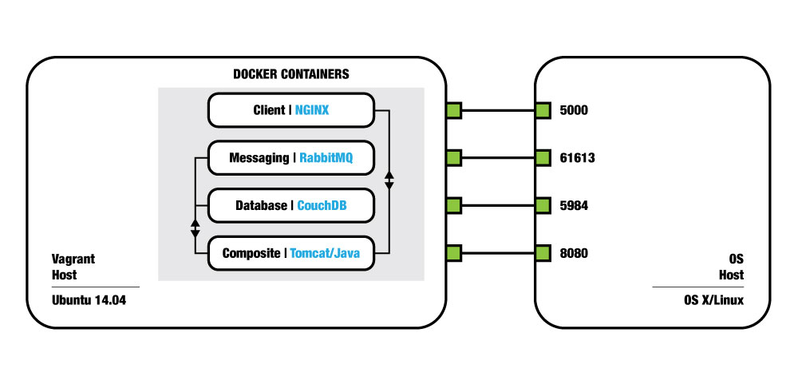

Composite Demo Reference
========================

Architecture
------------
The basic concept behind the Composite demo's architecture is that of Docker containers on a Vagrant host. Nothing new.

----

----

Each Docker container maps the main service port/s back to the Vagrant host, which in turns forwards those ports up to
the OS host, either a Linux or Mac OS X host. The service port mapping is as follows:

.. cssclass:: table-bordered
.. cssclass:: table-striped
+----------------+------------------------+------------------+
| Service        | Container < - > Vagrant| Vagrant < - > OS |
+================+========================+==================+
| Client (NGINX) | 5000                   | 5000             |
+----------------+------------------------+------------------+
| RabbitMQ       | 61613, 5672            | 61613            |
+----------------+------------------------+------------------+
| CouchDB        | 5984                   | 5984             |
+----------------+------------------------+------------------+
| Composite      | 8080                   | 8080             |
+----------------+------------------------+------------------+

Base Container
--------------
All above containers are built off of a container called ``local/base``. This container is simply an Ubuntu 14.04 container
with some basic tools installed:

* vim
* curl
* wget
* openssh-server
* pip
* puppet
* fabric

Importing Composite Containers
------------------------------
If you followed the `quickstart guide <../index.html#quickstart>`_, after you got the Vagrant host up and running you ran:

::

    $ sudo composite-demo

The underlying mechanics of this command, if you haven't already peeked, is simply:

#. Clone the `composite-demo repository <https://github.com/wieden-kennedy/composite-demo>`_.
#. Import the Docker containers from S3.
#. Run the Docker containers, linking appropriately, as indicated in the diagram above.

The underlying mechanism for performing steps two and three is a Fabric file at the root of the composite-demo repository.
It contains the following method for importing the Composite Docker containers:

.. code:: python

    def import_container(container_name=None):
        import_containers = CONTAINERS

        if container_name:
            import_containers = [x for x in import_containers if x['name'] == container_name]

        for c in import_containers:
            container = Container(env.environment, c)
            print(_white("==> Importing %s container from S3" % container.name))
            local('sudo curl %s | sudo docker import - %s/%s' % (container.s3_path,
                                                                 env.environment.lower(),
                                                                 container.name))

Taking this into account, should you want to re-import any or all containers, you can navigate to the composite-demo directory
at ``/home/vagrant/composite-demo`` and run one or more of the following commands:

.. code:: bash

    # import client, rabbitmq, couchdb, or composite
    $ fab import_container:[client|rabbitmq|couchdb|composite]

    # import client container
    $ fab import_container:client

    # import all containers
    $ fab import_container

Note that if you ran the quickstart, and imported the Composite containers, the base container will not be built.

Building Composite Containers
-----------------------------
By running ``sudo composite-demo`` when bringing up the Vagrant host, you may have run into a prompt to build the containers
locally, in the event that your internet connection was considered too slow to make effective use of downloading/importing
all containers. In this event, the containers would have been individually built using another Fabric method:

.. code:: python

    def build(container_name=None):
        killall_containers()

        build_containers = CONTAINERS
        base_container = local("sudo docker images | grep base | awk '{print $1}'", capture=True)

        # if container_name was passed, reduce build_containers to just that container
        if container_name:
            build_containers = [x for x in build_containers if x['name'] == container_name]
            # if the base container doesn't yet exist, build it
            if container_name != 'base' and not base_container == 'local/base':
                build('base')

        # build the service and composite containers
        for c in build_containers:
            build_container(c, env.environment)

Similar to ``fab import``, containers can be built all at once or individually:

.. code:: bash

    # build one container
    $ fab build:[base|client|rabbitmq|couchdb|composite]

    # build client container
    $ fab build:client

    # build all containers
    $ fab build

Fabfile Reference
-----------------
The ``import_container`` and ``build`` methods are the most commonly used. Below is a reference of the methods
available to you from within the Fabric file included with the composite-demo [#]_.

Methods
-------

import_container(container_name=None)
^^^^^^^^^^^^^^^^^^^^^^^^^^^^^^^^^^^^^
Imports one or more containers from S3 by name.

::

    # import client
    $ fab import_container:client

    # import rabbitmq
    $ fab import_container:rabbitmq

    # import couchdb
    $ fab import_container:couchdb

    # import composite
    $ fab import_container:composite

    # import all containers
    $ fab import_container

build(container_name=None)
^^^^^^^^^^^^^^^^^^^^^^^^^^

Builds one or more containers using the Dockerfiles included in the demo repository.

::

    # build client
    $ fab build:client

    # build rabbitmq
    $ fab build:rabbitmq

    # build couchdb
    $ fab build:couchdb

    # build composite
    $ fab build:composite

    # build all containers
    $ fab build

run()
^^^^^
Runs the Composite demo containers, linking the service containers to the web application container

::

    # run all containers
    $ fab run

killall_containers()
^^^^^^^^^^^^^^^^^^^^
Kills and removes all running or exited Docker processes.

::

    # kill and remove all Docker processes
    $ fab killall_containers

delete_image(container_name=None)
^^^^^^^^^^^^^^^^^^^^^^^^^^^^^^^^^
Deletes one or more container images on the Vagrant host machine.

::

    # delete client
    $ fab delete_image:client

    # delete rabbitmq
    $ fab delete_image:rabbitmq

    # delete couchdb
    $ fab delete_image:couchdb

    # delete composite
    $ fab delete_image:composite

    # delete all Docker images
    $ fab delete_image

.. [#] Technically there are more methods available in the Fabric file, but the remaining few methods are used internally,
       for the most part. To see the rest, check out the `fabfile <https://github.com/wieden-kennedy/composite-demo/blob/master/fabfile.py>`_.
