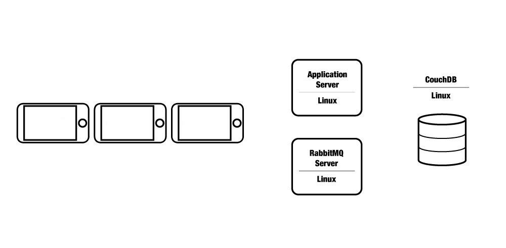
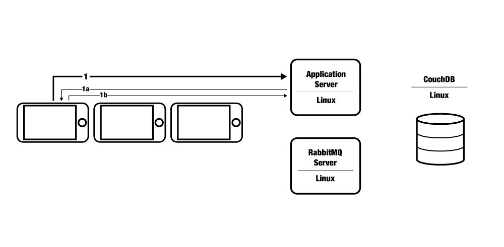
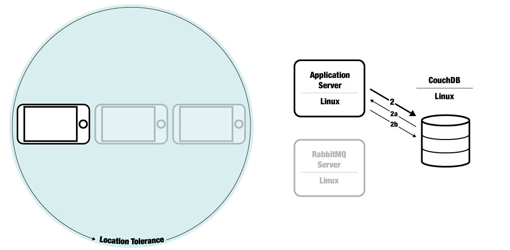
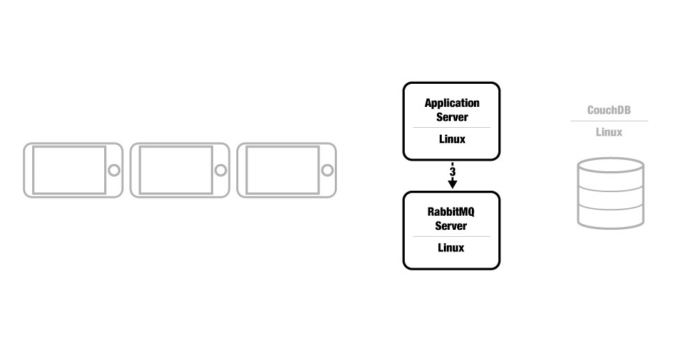
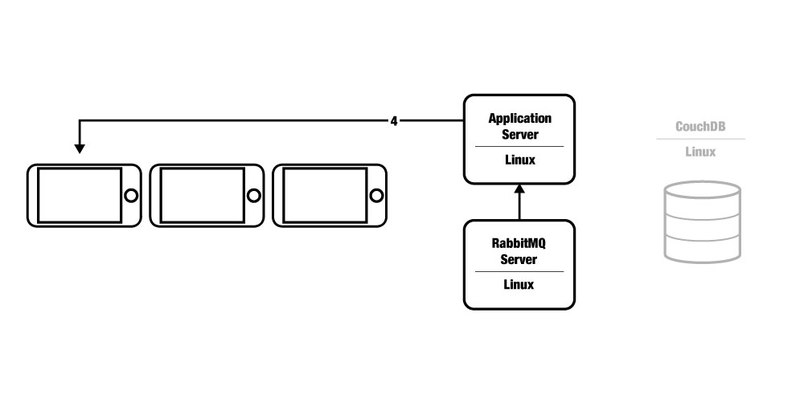
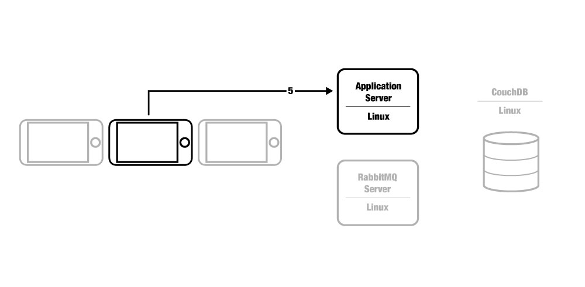
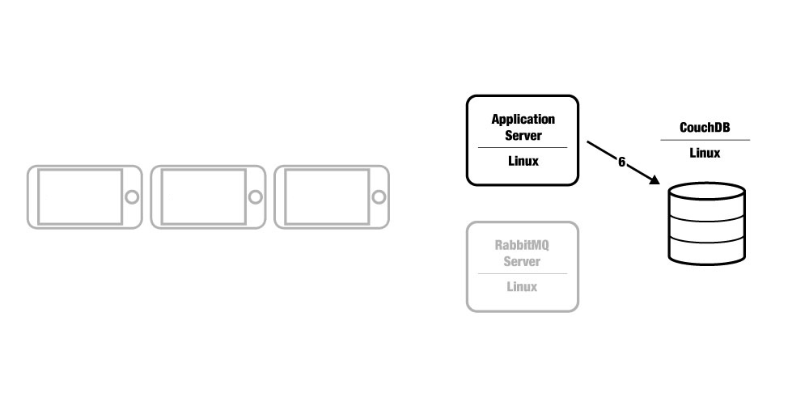
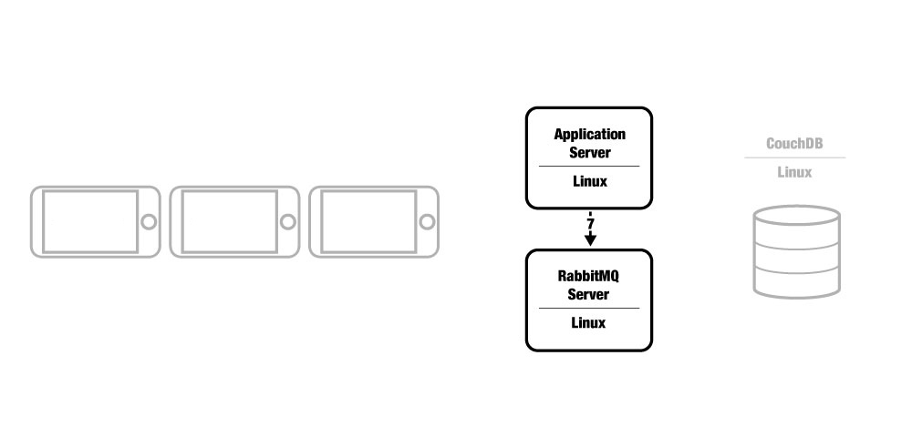
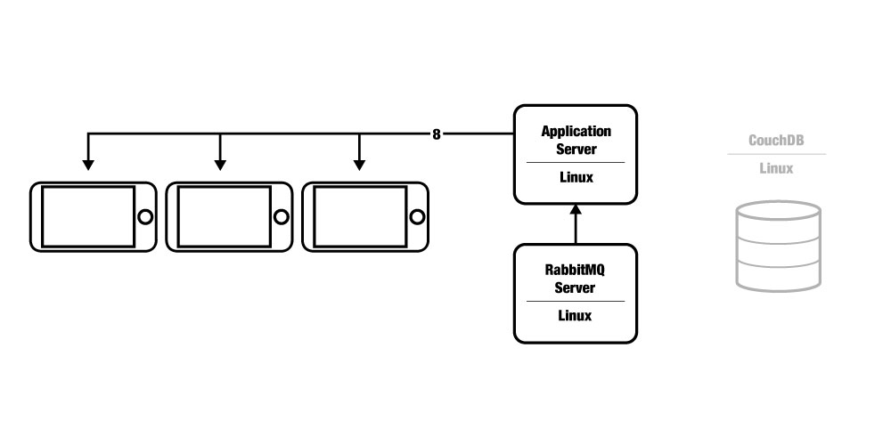

Application Landscape
=====================
This section describes the general application landscape and event chain for a Composite application.

Major Components
----------------
Four major components are part of the Composite application landscape:

* a group of mobile phones
* a Tomcat server
* a RabbitMQ message broker server
* a CouchDB NoSQL database server

----

Ways to Join a Session
~~~~~~~~~~~~~~~~~~~~~~
Composite supports two main ways of joining into a session:

* **Proximity-based**: devices are paired up with other devices in their proximity to create a shared session. In this
  mode, the session can have many devices, but is by default limited to eight.
* **Direct pairing**: devices are paired with the next available device for a shared session. In this mode, typically
  the session will be limited to two devices.

The key difference between proximity-based pairing and direct pairing is that in the former location information is used
to prioritize which session a new device is paired with, whereas with latter, the first available open session is used
for pairing. This difference occurs in step 2 below.

----

1. Registering with the server
~~~~~~~~~~~~~~~~~~~~~~~~~~~~~~

Three discrete sub-steps are involved here, denoted 1, 1a, and 1b respectively.

* Firstly, on mobile phone A, a Composite-driven web application is loaded in the browser.
  Once the user has approved the use of location services, the phone will try to make contact with the application
  server via Sockjs protocol (1).
* Next, the application server has acknowledged the device, and sent it a subscription id for sending and receiving
  socket messages (1a).
* Lastly, the phone again contacts the application server to say "I want to join a session." (1b)

----

2. The application server checks for existing sessions
~~~~~~~~~~~~~~~~~~~~~~~~~~~~~~~~~~~~~~~~~~~~~~~~~~~~~~

The application server takes the phone's geolocation and uses a Haversine function to determine whether any existing, open sessions
are within a tolerated radius of the new phone. If an open session is found, the new phone is added to it, otherwise, a new session
is created. The first and second steps in this process differs depending on the type of pairing being performed:

**For proximity-based pairing:**

* First, it queries the CouchDB database for all unlocked (open) sessions (2).

* Next, it receives a list of open sessions back from the database, then either adds the new phone to an existing open session,
  if one is found within the tolerated range, or creates a new one, if no open sessions are found that are close enough (2a).

**For direct pairing:**

* First, the application server queries the database for one open session (it doesn't care which) (2).

* Second, if it finds an open session, it adds the new phone to that session. If it does not find an open session,
  a new session is created (2a).

**In either pairing scenario, lastly the application server will:**

* Update the CouchDB database either with the new session, or the updated session that was found (2b).

----

3. Pushing the message to the broker
~~~~~~~~~~~~~~~~~~~~~~~~~~~~~~~~~~~~

With the phone added to a session, a socket message is pushed to the broker for delivery to the correct subscriber queue,
which is the individual phone's queue. Other devices in the same session are notified via a topic channel that a new device
has joined (see section 5 below, `*Update lifecycle* <#5-update-lifecycle>`_)

----

4. Device is notified it is part of a session
~~~~~~~~~~~~~~~~~~~~~~~~~~~~~~~~~~~~~~~~~~~~~

Once the device has been recorded in a session and subscribed to that session's topic, the messaging broker proxies a
message through the Application Server, to the device's queue letting the device know it's part of a session.

This process is repeated each time a new phone joins a session.

----

Update Lifecycle
----------------
Once devices are in a session, the update cycle begins, where the devices send an update message to the application server
at a rate of 20 messages per second. These updates are then pushed back out on the session's topic channel, so that all
of the devices in the session are updated with instructions from each other.

5. An update is sent
~~~~~~~~~~~~~~~~~~~~

As an example, let's consider a situation in which a ball is moving across the screens in session. It would be helpful
for each device to know if the ball was about to enter its screen, so on the client side, an update message containing the
ball position should be fired periodically.

Here the second device is sending an update to the server.

----

6. The session record is updated
~~~~~~~~~~~~~~~~~~~~~~~~~~~~~~~~

Before sending the update message on to the broker, the application server updates the database record for the device's
session. This helps distinguish stale sessions from active ones by updating a lastUpdated timestamp.

----

7. Pushing the message to the broker
~~~~~~~~~~~~~~~~~~~~~~~~~~~~~~~~~~~~

The application then forwards the update message on to the message broker for queueing.

----

8. Broadcasting the message
~~~~~~~~~~~~~~~~~~~~~~~~~~~

The update message is sent out to the session topic, so that all session devices are updated with the new information. Now
they all know where the ball is relative to their screens, and if they need to do anything.

