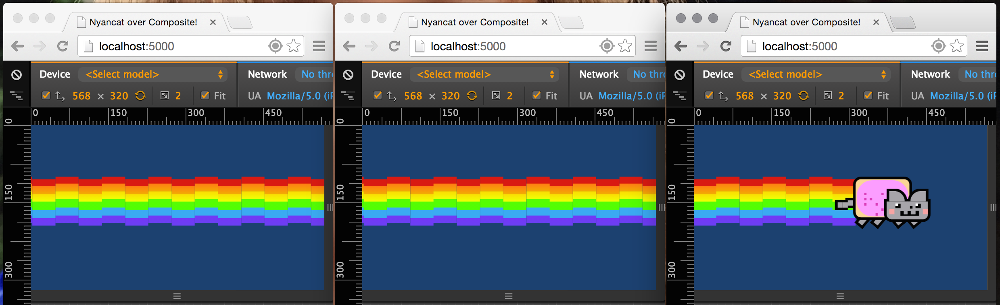

What is Composite?
==================

Composite is an end-to-end framework for managing web-scale socket communication between devices in a shared session,
allowing devices to communicate with each other, keep each other up-to-date, and to create a multi-screen, shared experience for the devices.

Think of it like a post office and a mail carrier in one - anyone connected to it can send messages to it, and it will
deliver messages to anyone for whom the messages are intended. Yes, like the post office, but much, much faster.

Composite's backend is a Spring-based Java application, that relies on CouchDB for managing temporary data storage,
RabbitMQ for message brokering and StompJS for sending/receiving messages with connected clients.

Composite's frontend client is a Javascript-based application that relies on StompJS for communicating between client and server.

----

What can Composite be used for?
===============================

At Wieden+Kennedy, we have built a few web-scale multiplayer games with Composite, using both the proximity-based pairing and
direct-pairing features discussed `here <./doc_sections/landscape.html#ways-to-join-a-session>`_, but games are not the only
thing it could be used for.

Composite is a very simple thing. It doesn't know what is happening on the user end, which is its beauty.
It only knows how to send and receive messages to a group of connected devices.

Whatever you can think of that can benefit from real-time multi-device communication can use Composite to manage the
communication stream.

----

Quickstart
==========
The easiest way to check out Composite in action is to download and run our Vagrant demo.
To do this, you will want to have both of the following tools installed:

* `Vagrant <http://www.vagrantup.com>`_
* `Virtual Box <http://www.virtualbox.org>`_

::

    $ wget https://compositeframework.io/static/demo/Vagrantfile
    $ vagrant up && vagrant ssh

This will download the Vagrant box, spin it up, and ssh into it. Once inside, you'll just need to run one more command
to get some docker containers spun up and mapped back to your localhost.

::

    $ sudo composite-demo

This command will import and spin up four Docker containers. While this is working, go grab a beverage of your choice.
The imports can take a few minutes, especially if you're working on a slower connection.

For each container listed, port mapping goes from container to the Vagrant host to your local machine:

.. cssclass:: table-striped
.. cssclass:: table-bordered
+----------------+---------------+-------------+
| Container      | Service       | Mapped port |
+================+===============+=============+
| Composite      | Tomcat        | 8080        |
+----------------+---------------+-------------+
| Database       | CouchDB       | 5984        |
+----------------+---------------+-------------+
| Message Broker | RabbitMQ      | 61613       |
+----------------+---------------+-------------+
| Web Client     | NGINX         | 5000        |
+----------------+---------------+-------------+

Once these containers are up, you should be able to hit your system's address on port 5000 with a mobile device or a
browser in emulation mode to get going. Once you hit localhost:5000 with three devices or browsers in emulation mode, the demo will start.

The demo is our favorite internet cat, Nyancat, streaming across the screens of the paired devices. Dragging
Nyancat will move it up and down across the screens. Totally simple demo, but shows you that the device screens are linked
via Composite messaging.

----

Slowstart
=========

.. toctree::
   :maxdepth: 3

   1. Installation <doc_sections/installation.rst>
   2. Application Landscape <doc_sections/landscape.rst>
   3. Settings (Configuration) <doc_sections/settings.rst>
   4. Appendices <doc_sections/appendices.rst>

----

License
=======
This repository and its code are licensed under the BSD 3-Clause license, which can be found `here <https://github.com/wieden-kennedy/composite/blob/master/LICENSE>`_.

